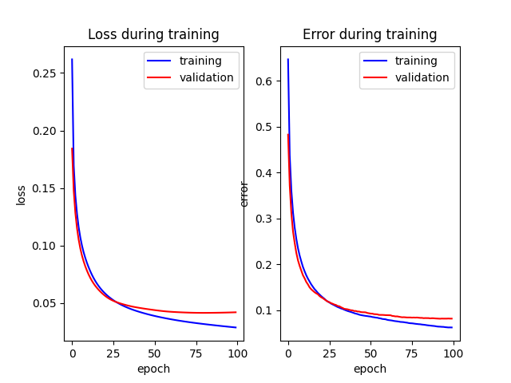

# MLP-for-MNIST-Hand-writtern-Digits-Classification
(1) **Acticaiton Function**: Identity, Sigmoid, Tanh, ReLU  
(2) **Loss Function**: Soft-max Cross-Entropy Loss  
(3) Customize the # of neurons, # of layers, and activation functions in the main function   
  
The Training Process:   
  
  
The Testing Result:  
Test Loss of the MLP on the 10000 test images: **0.044075658928084294**  
Test Error of the MLP on the 10000 test images: **8.89 %**
